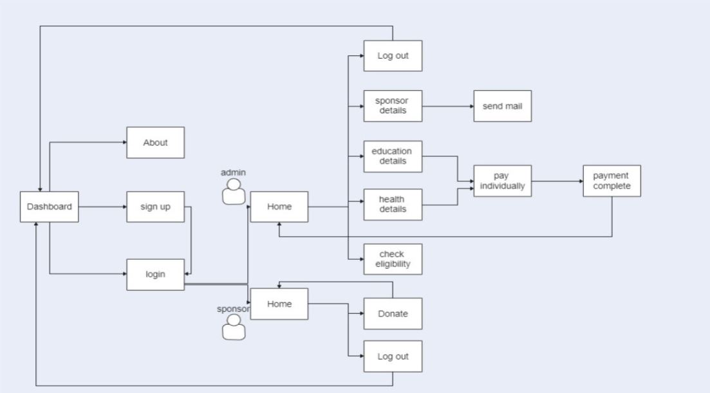

# 2021_IBM_Code_Challenge_Web App for Health and Education facilities in Rural area - "Unearth and Serve"

## List of Contributors ##

**Mentors:**

1. Indubharathi Routhu - IBM,India

2. Saurabh Agrawal     - IBM,India

**Participants**

1. Archana S - LBS Institute of Technology for Women, Thiruvananthapuram, Kerala

2. Renju R S - LBS Institute of Technology for Women, Thiruvananthapuram, Kerala

3. Shivanya P M - LBS Institute of Technology for Women, Thiruvananthapuram, Kerala

4. Sreekutty S Vinod - LBS Institute of Technology for Women, Thiruvananthapuram, Kerala

5. V.Meenakshi - LBS Institute of Technology for Women, Thiruvananthapuram, Kerala

## Problem Statement 

This repository contains the implementation of " **UNEARTH AND SERVE - Health and Education Support System in Rural areas** " by combining the techniques of **Machine Learning and Web Application**. We are focusing on the idea to Locate and Help. There are more people in rural areas who are not getting any proper health and education services.
Our aim is to locate, identify the eligible people and provide support for health and education.

## Outline of the project

Develop a Web-app for Health and Education Support system in rural areas in Kerala.

Identify the Rural areas and list them in the Application.

Collect the details of residents in the particular area from a Person of Contact (PoC), Educational Institutions and Hospitals in that area.The details include Aadhar Number,Rationcard Category, Monthly Income etc.in order to identify the eligible person. Created 2 dummy datasets for both education and health data.

Perform supervised learning on the dataset to train the model according to existing dataset.

Import the JSON file to the web-app for automation.

List the needy persons' details under both the categories.

Administrators' calculate the expected fund for each category according to expert opinion.

Invite sponsors to support - the first level will be through social media. We are focusing more on CSR funds in industries.

The needy persons will be intimated through the Person of Contact.

**Future scope:** 

Implement crowd funding to help needy persons as early as possible especially those who are suffering due to health issues. Transparency of crowd funding can be made sure by using a generic block chain framework.

## Architecture

## User Flow

